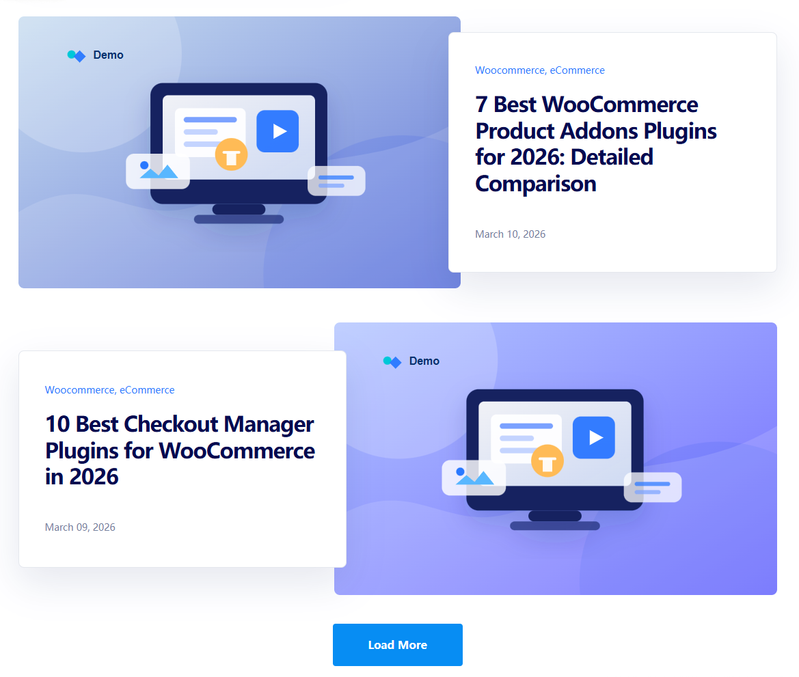

# WordPress 左右交错式博客卡片布局

一个适用于 WordPress 博客列表页、企业新闻列表页、内容营销文章列表页的响应式前端布局示例。

该项目使用 **HTML + CSS + JavaScript** 实现桌面端左右交错式文章卡片效果，并考虑了后期集成到 WordPress 主题模板时的循环输出方式。

---

## 效果预览



---

## 项目特点

- 桌面端支持图片与文字卡片左右交错展示
- 文字内容卡片可叠压到图片区域上，增强页面层次感
- 奇数行与偶数行自动形成交替布局
- 已优化奇数行和偶数行文字卡片宽度一致性
- 移动端自动切换为图片在上、文字在下的结构
- CSS、JS、图片资源独立分离，便于维护
- 使用 SVG 占位图，方便后期替换为真实文章特色图片
- 提供 WordPress Loop 示例，便于主题开发时循环输出文章列表

---

## 目录结构

```text
wordpress-alternating-blog-card-layout/
├── index.html
├── wordpress-loop-example.php
├── README.md
├── assets/
│   ├── css/
│   │   └── blog-layout.css
│   ├── js/
│   │   └── blog-layout.js
│   └── images/
│       ├── blog-card-01.svg
│       ├── blog-card-02.svg
│       ├── blog-card-03.svg
│       └── blog-card-04.svg
└── docs/
    └── screenshots/
        └── blog-card-layout-preview.png
```

---

## 文件说明

### `index.html`

静态 HTML 预览页面，用于直接查看布局效果。

适合用于：

- 本地预览
- 前端样式调试
- GitHub Pages 展示
- 后期改造成 WordPress 模板前的参考页面

### `assets/css/blog-layout.css`

核心样式文件，包含：

- 页面容器布局
- 博客卡片布局
- 图片与文字卡片重叠效果
- 奇偶行左右交错规则
- 响应式适配规则
- 移动端图片在上、文字在下的布局

### `assets/js/blog-layout.js`

独立 JavaScript 文件。

当前主要用于保留后期扩展能力，例如：

- 加载更多文章
- Ajax 请求文章列表
- 滚动动画
- 点击统计
- 卡片进入视口动画

### `assets/images/`

存放 SVG 占位图。

实际集成到 WordPress 时，可以替换为文章特色图片：

```php
<?php the_post_thumbnail('large'); ?>
```

### `wordpress-loop-example.php`

WordPress 循环输出示例文件。

这个文件展示了如何在 WordPress 中根据文章循环索引自动添加奇偶行样式，例如：

```php
$is_reverse = $index % 2 === 1 ? ' is-reverse' : '';
```

这样可以让文章列表在程序循环输出时自动形成左右交错布局。

---

## 布局逻辑说明

桌面端布局主要分为两种状态：

### 奇数卡片

图片在左侧，文字卡片在右侧，并向图片方向产生一定重叠。

```html
<article class="blog-card">
  ...
</article>
```

### 偶数卡片

文字卡片在左侧，图片在右侧，并向图片方向产生一定重叠。

```html
<article class="blog-card is-reverse">
  ...
</article>
```

通过给偶数项添加 `is-reverse` 类名，即可实现交错效果。

---

## 移动端适配

移动端时，不再保留左右交错与重叠结构，而是统一改为：

```text
图片
文字内容
```

这样可以保证手机端阅读体验更清晰，也避免文字卡片和图片在小屏幕上出现挤压。

---

## WordPress 集成思路

在 WordPress 主题模板中，可以将每篇文章作为一个 `article.blog-card` 输出。

示例逻辑：

```php
<?php
$index = 0;
if ( have_posts() ) :
  while ( have_posts() ) : the_post();
    $reverse_class = $index % 2 === 1 ? ' is-reverse' : '';
?>

<article class="blog-card<?php echo esc_attr($reverse_class); ?>">
  <a class="blog-card__image" href="<?php the_permalink(); ?>">
    <?php if ( has_post_thumbnail() ) : ?>
      <?php the_post_thumbnail('large'); ?>
    <?php endif; ?>
  </a>

  <div class="blog-card__content">
    <div class="blog-card__categories">
      <?php the_category(', '); ?>
    </div>

    <h2 class="blog-card__title">
      <a href="<?php the_permalink(); ?>"><?php the_title(); ?></a>
    </h2>

    <div class="blog-card__date">
      <?php echo get_the_date(); ?>
    </div>
  </div>
</article>

<?php
    $index++;
  endwhile;
endif;
?>
```

---

## 后期可扩展方向

后期可以继续扩展以下功能：

- 添加文章摘要
- 添加作者信息
- 添加阅读更多按钮
- 支持 Ajax Load More 加载更多
- 添加分类筛选功能
- 添加文章卡片进入视口动画
- 接入 WordPress REST API
- 改造成 Gutenberg 区块
- 改造成 Elementor 自定义组件
- 用于 WooCommerce 内容营销文章列表页

---

## 适用场景

- WordPress 博客列表页
- 企业官网新闻中心
- WooCommerce 内容营销页面
- 插件官网文章列表
- 产品教程文章列表
- 案例展示列表页
- 前端布局学习示例

---

## 版本记录

### v1.0.0

完成 WordPress 左右交错式博客卡片布局初始版本。

主要更新：

- 新增静态 HTML 页面
- 新增独立 CSS 和 JS 文件
- 新增 SVG 占位插画
- 新增 WordPress Loop 示例
- 实现桌面端图片与文字卡片重叠效果
- 实现奇数行与偶数行左右交错布局
- 修复偶数行文字卡片位移方向问题
- 优化奇数行与偶数行文字卡片宽度一致性
- 实现移动端图片在上、文字在下的响应式布局

---

## License

本项目可作为 WordPress 主题开发、前端页面练习和企业网站页面设计参考使用。
